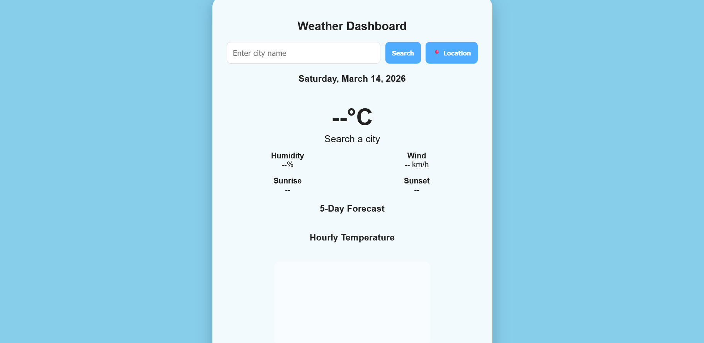
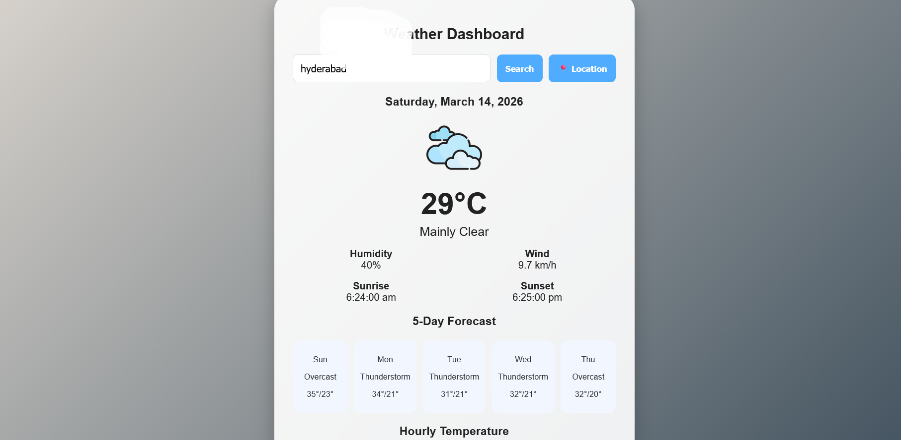
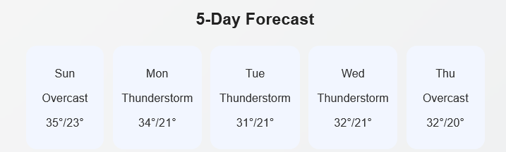
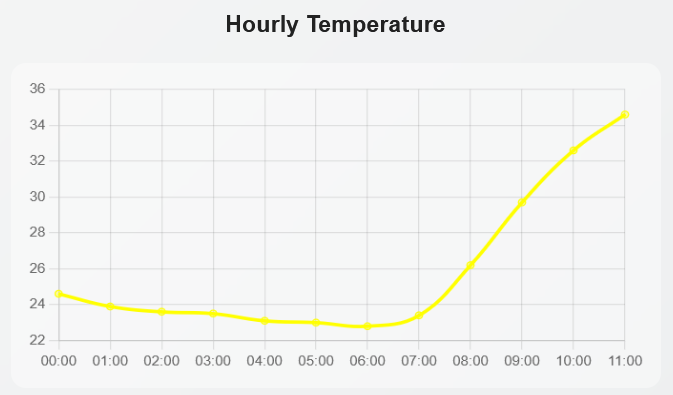

# 🌦 Weather Dashboard

A responsive Weather Dashboard Web App that displays real-time weather information, a 5-day forecast, and hourly temperature charts.  
The application allows users to search for a city or use their current location to view weather conditions.

The app is built using HTML, CSS, and JavaScript, and it uses a free weather API to fetch live weather data

## 📸 Screenshots

 ### Weather Dashboard
 
 
 ### Weather Report
 
 
 ### 5 Day Forecast
 

 ### Hourly Temperature Chart
  

## 🚀 Features

- 🌍 Search weather by city name
- 📍 Get weather using current location
- 🌡 Displays current temperature and conditions
- 💧 Shows humidity and wind speed
- 🌅 Displays sunrise and sunset times
- 📅 5-Day weather forecast
- 📊 Hourly temperature chart
- 🎨 Dynamic background based on weather
- ☀️ Weather animations (sun, clouds, rain)
- ⚡ Loading screen
- 📱 Progressive Web App (PWA) support
- 📡 Offline caching using Service Worker

## 🛠 Technologies Used

- HTML5
- CSS3
- JavaScript (ES6)
- Chart.js
- Service Workers (for offline support)
- Web App Manifest (PWA)

## 🌐 API Used

This project uses the free Open-Meteo Weather API.

- API Provider: Open-Meteo
- Website: https://open-meteo.com
- Cost: Free to use (no API key required)

### Services used

- Weather Forecast API
- Geocoding API

### Example API request
   https://api.open-meteo.com/v1/forecast

## ⚙️ How to Run the Project

1. Clone the repository
git clone https://github.com/your-username/weather-dashboard.git
2. Open the project folder.  
3. Run **index.html** in a browser.
No installation or API key is required.

## 📱 Progressive Web App (PWA)

This application supports Progressive Web App features:

- Installable on mobile or desktop
- Works offline using Service Worker caching
- Fast loading experience

## 📌 Future Improvements

- Add more detailed weather animations
- Show air quality index
- Add temperature unit toggle (°C / °F)
- Improve mobile responsiveness
- Add dark mode

